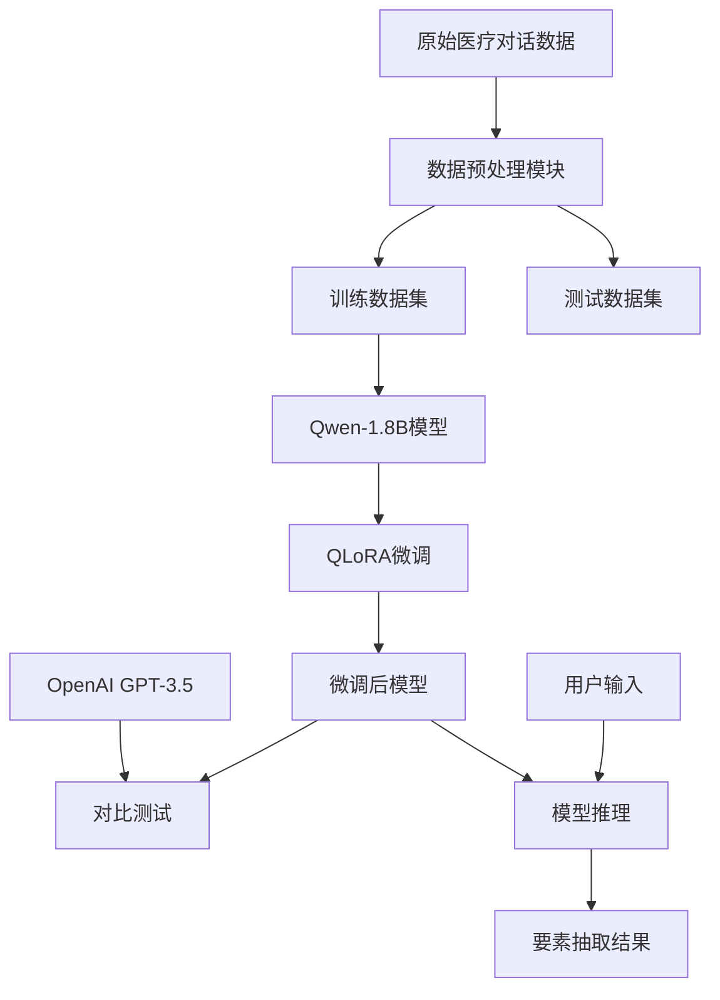
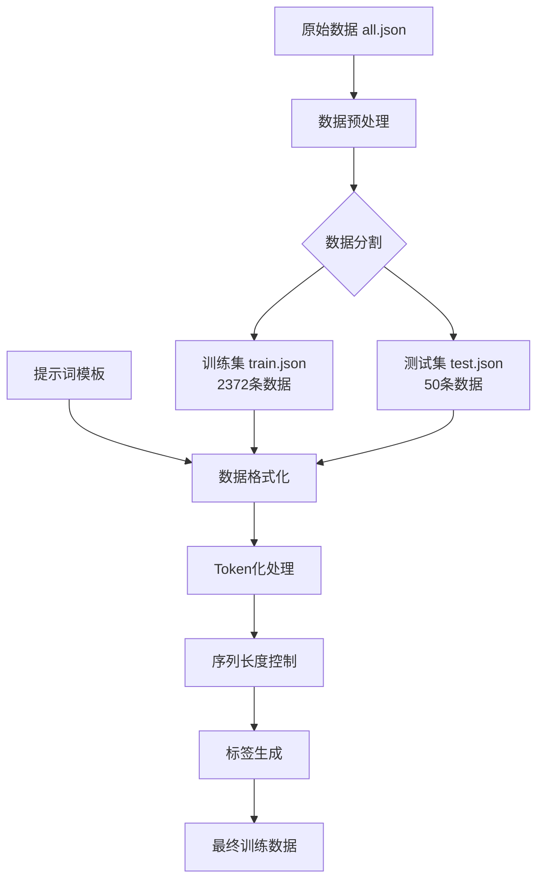
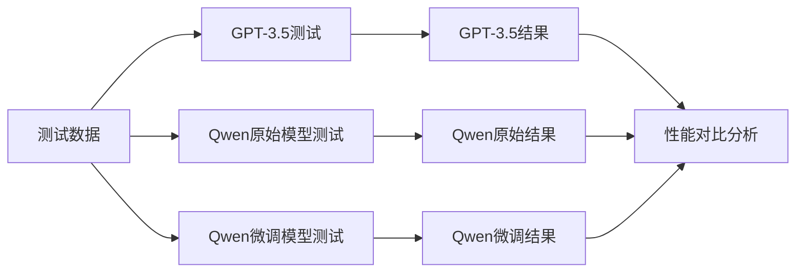
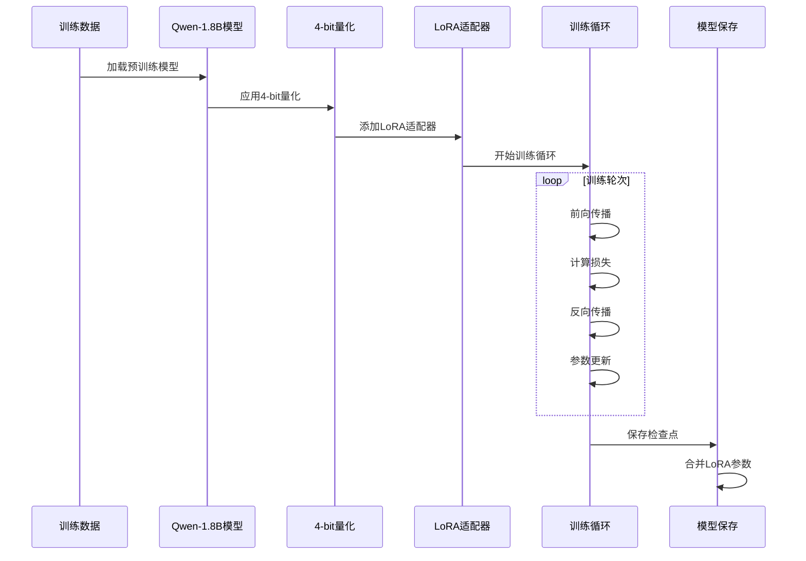
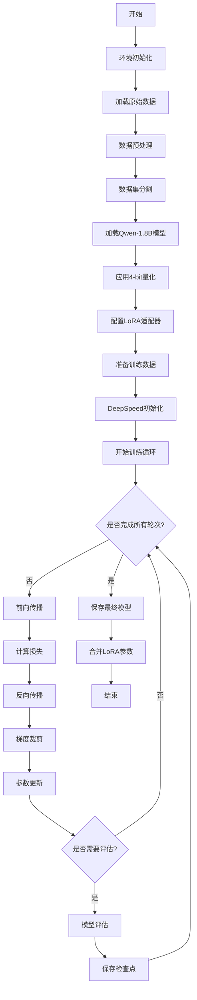
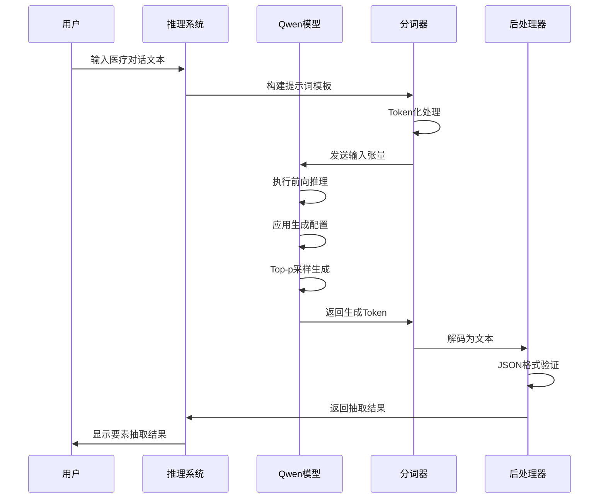
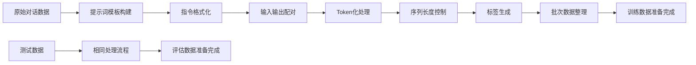
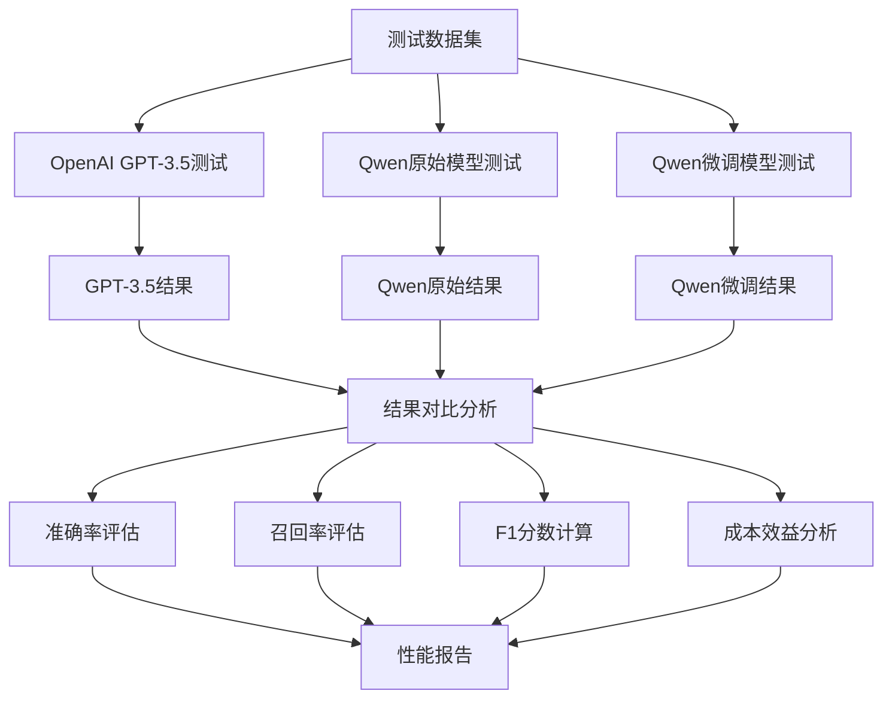

# 医疗对话要素抽取系统技术方案文档

## 目录

1. [项目概述](#1-项目概述)
2. [技术架构](#2-技术架构)
3. [数据处理流程](#3-数据处理流程)
4. [模型对比分析](#4-模型对比分析)
5. [模型微调技术](#5-模型微调技术)
6. [核心代码实现](#6-核心代码实现)
7. [系统流程图](#7-系统流程图)
8. [部署与使用指南](#8-部署与使用指南)
9. [性能评估](#9-性能评估)
10. [总结与展望](#10-总结与展望)

---

## 1. 项目概述

### 1.1 项目背景

本项目旨在通过大型语言模型技术，从医疗对话数据中自动抽取关键医疗要素，包括：
- **药品名称**：对话中提到的具体药物名称
- **药物类别**：药物的分类信息
- **医疗检查**：各种医学检查项目
- **医疗操作**：医疗过程中的操作行为
- **现病史**：患者当前疾病的发展历程
- **辅助检查**：辅助诊断的检查项目
- **诊断结果**：医生的诊断结论
- **医疗建议**：医生给出的治疗建议

### 1.2 技术选型

本项目采用以下核心技术：

- **基础模型**：Qwen-1.8B-Chat（通义千问1.8B对话模型）
- **微调技术**：QLoRA（Quantized Low-Rank Adaptation）
- **训练框架**：DeepSpeed + PyTorch
- **对比模型**：OpenAI GPT-3.5-turbo
- **数据格式**：JSON结构化输出

### 1.3 项目目标

1. **准确性**：实现高精度的医疗要素抽取
2. **效率性**：支持大规模数据的快速处理
3. **可扩展性**：支持新的医疗要素类型扩展
4. **实用性**：提供完整的训练和推理解决方案

---

## 2. 技术架构

### 2.1 整体架构



### 2.2 核心组件

#### 2.2.1 数据处理层
- **数据加载器**：`QwenPromptDataSet`类
- **数据整理器**：`DataCollator`类
- **预处理工具**：`data_helper.py`

#### 2.2.2 模型层
- **基础模型**：Qwen-1.8B-Chat
- **微调适配器**：LoRA配置
- **量化配置**：4-bit量化

#### 2.2.3 训练层
- **分布式训练**：DeepSpeed ZeRO-2
- **优化器**：AdamW
- **学习率调度**：WarmupDecayLR

#### 2.2.4 推理层
- **模型融合**：LoRA参数合并
- **生成配置**：Top-p采样、温度控制
- **后处理**：JSON格式化输出

---

## 3. 数据处理流程

### 3.1 数据流程图



### 3.2 数据格式

#### 3.2.1 原始数据格式
```json
{
    "dialogue_text": "医生: 你好\n患者: 我想咨询...",
    "extract_text": {
        "药品名称": ["阿莫西林", "布洛芬"],
        "药物类别": ["抗生素"],
        "医疗检查": ["血常规"],
        "医疗操作": [],
        "现病史": "患者发热3天",
        "辅助检查": "血常规检查",
        "诊断结果": "上呼吸道感染",
        "医疗建议": "多休息，按时服药"
    }
}
```

#### 3.2.2 训练数据格式
```json
{
    "instruction": "你现在是一个医疗对话要素抽取专家...",
    "input": "医生: 你好\n患者: 我想咨询...",
    "output": "```json\n{...}\n```"
}
```

---

## 4. 模型对比分析

### 4.1 模型特点对比

| 特性 | OpenAI GPT-3.5 | Qwen-1.8B-Chat |
|------|----------------|----------------|
| 参数规模 | ~175B | 1.8B |
| 部署方式 | API调用 | 本地部署 |
| 成本 | 按Token计费 | 一次性成本 |
| 定制化 | 有限 | 完全可控 |
| 数据隐私 | 云端处理 | 本地处理 |
| 响应速度 | 网络依赖 | 硬件依赖 |
| 微调能力 | 不支持 | 完全支持 |

### 4.2 性能对比



---

## 5. 模型微调技术

### 5.1 QLoRA技术原理

QLoRA（Quantized Low-Rank Adaptation）是一种高效的大模型微调技术，具有以下特点：

1. **4-bit量化**：将模型权重量化为4-bit，大幅减少显存占用
2. **低秩适配**：只训练少量的低秩矩阵参数
3. **双重量化**：进一步优化量化精度
4. **梯度检查点**：减少训练时的显存占用

### 5.2 微调流程图



### 5.3 关键参数配置

```python
# LoRA配置参数
lora_config = {
    "r": 16,                    # LoRA秩
    "lora_alpha": 64,          # LoRA缩放因子
    "lora_dropout": 0.1,       # LoRA dropout率
    "bias": "none",            # 不训练bias
    "task_type": "CAUSAL_LM"   # 因果语言模型
}

# 训练参数
training_config = {
    "learning_rate": 1e-4,           # 学习率
    "num_train_epochs": 3,           # 训练轮数
    "per_device_train_batch_size": 2, # 批次大小
    "gradient_accumulation_steps": 4, # 梯度累积
    "warmup_ratio": 0.03,            # 预热比例
    "weight_decay": 0.1,             # 权重衰减
    "max_len": 2048,                 # 最大序列长度
    "max_src_len": 1560              # 最大输入长度
}
```

---

## 6. 核心代码实现

### 6.1 数据处理模块

#### 6.1.1 数据预处理 (`data_helper.py`)

```python
import json
import random

def data_helper(path, train_save_path, test_save_path):
    """
    数据处理函数
    
    功能：
    1. 加载原始医疗对话数据
    2. 构建标准化的提示词模板
    3. 格式化输出为JSON格式
    4. 随机分割训练集和测试集
    
    Args:
        path: 原始数据文件路径
        train_save_path: 训练数据保存路径
        test_save_path: 测试数据保存路径
    """
    save_data = []
    
    # 定义标准化提示词模板
    instruction = (
        "你现在是一个医疗对话要素抽取专家。\n"
        "请针对下面对话内容抽取出药品名称、药物类别、医疗检查、医疗操作、"
        "现病史、辅助检查、诊断结果和医疗建议等内容，并且以json格式返回，"
        "Key为上述待抽取的字段名称，Value为抽取出的文本内容。\n"
        "注意事项：\n"
        "（1）药品名称、药物类别、医疗检查和医疗操作的内容会在对话中存在多个，"
        "因此Value内容以List形式存放；若抽取内容为空，则为一个空的List；\n"
        "（2）抽取出的药品名称、药物类别、医疗检查和医疗操作对应内容，"
        "需要完全来自于原文，不可进行修改，内容不重复；\n"
        "（3）现病史、辅助检查、诊断结果和医疗建议的内容需要根据整个对话内容"
        "进行总结抽取，Value内容以Text形式存放。\n"
        "对话文本：\n"
    )
    
    print("=" * 50)
    print("OpenAI GPT-3.5 医疗对话要素抽取测试")
    print("输入 'quit' 或 'exit' 退出程序")
    print("=" * 50)
    
    # 交互式测试
    while True:
        try:
            print("\n请输入医疗对话内容：")
            text = input("> ")
            
            if text.lower() in ['quit', 'exit', '退出']:
                print("程序退出")
                break
            
            if not text.strip():
                print("输入不能为空，请重新输入")
                continue
            
            print("\n正在调用GPT-3.5...")
            
            # 执行预测
            response = predict_openai(client, instruction, text)
            
            print("\n=== GPT-3.5抽取结果 ===")
            print(response)
            print("=" * 30)
            
        except KeyboardInterrupt:
            print("\n程序被用户中断")
            break
        except Exception as e:
            print(f"\n发生错误: {e}")
            print("请重新输入")


if __name__ == '__main__':
    main()
```

#### 6.4.2 Qwen模型测试 (`test_qwen.py`)

```python
import torch
from qwen1_8.tokenization_qwen import QWenTokenizer
from qwen1_8.modeling_qwen import QWenLMHeadModel


def predict_qwen(model, tokenizer, instruction, text):
    """
    使用Qwen模型进行医疗对话要素抽取
    
    Args:
        model: Qwen模型实例
        tokenizer: Qwen分词器
        instruction: 任务指令
        text: 对话文本
        
    Returns:
        str: Qwen模型的抽取结果
    """
    try:
        # 构建输入
        prompt = instruction + text
        inputs = tokenizer(prompt, return_tensors="pt").to(model.device)
        
        # 生成配置
        generation_config = {
            "max_new_tokens": 512,
            "do_sample": True,
            "top_p": 0.8,
            "temperature": 0.8,
            "repetition_penalty": 1.1
        }
        
        # 执行生成
        with torch.no_grad():
            outputs = model.generate(
                **inputs,
                **generation_config,
                pad_token_id=tokenizer.pad_token_id
            )
        
        # 解码结果
        response = tokenizer.decode(
            outputs[0][len(inputs["input_ids"][0]):], 
            skip_special_tokens=True
        )
        
        return response
        
    except Exception as e:
        return f"模型推理失败: {e}"


def main():
    """
    Qwen模型测试主函数
    
    功能：
    1. 加载Qwen-1.8B模型
    2. 交互式医疗对话要素抽取
    3. 与GPT-3.5结果对比
    """
    # 模型配置
    model_path = "qwen1_8/"  # Qwen-1.8B模型路径
    device = "cuda:0" if torch.cuda.is_available() else "cpu"
    
    print(f"使用设备: {device}")
    print(f"模型路径: {model_path}")
    
    # 加载模型和分词器
    print("加载Qwen-1.8B模型...")
    tokenizer = QWenTokenizer.from_pretrained(model_path)
    model = QWenLMHeadModel.from_pretrained(
        model_path,
        torch_dtype=torch.float16,
        device_map=device
    )
    model.eval()
    
    # 预定义指令模板
    instruction = (
        "你现在是一个医疗对话要素抽取专家。\n"
        "请针对下面对话内容抽取出药品名称、药物类别、医疗检查、医疗操作、"
        "现病史、辅助检查、诊断结果和医疗建议等内容，并且以json格式返回，"
        "Key为上述待抽取的字段名称，Value为抽取出的文本内容。\n"
        "注意事项：\n"
        "（1）药品名称、药物类别、医疗检查和医疗操作的内容会在对话中存在多个，"
        "因此Value内容以List形式存放；若抽取内容为空，则为一个空的List；\n"
        "（2）抽取出的药品名称、药物类别、医疗检查和医疗操作对应内容，"
        "需要完全来自于原文，不可进行修改，内容不重复；\n"
        "（3）现病史、辅助检查、诊断结果和医疗建议的内容需要根据整个对话内容"
        "进行总结抽取，Value内容以Text形式存放。\n"
        "对话文本：\n"
    )
    
    print("模型加载完成！")
    print("=" * 50)
    print("Qwen-1.8B 医疗对话要素抽取测试")
    print("输入 'quit' 或 'exit' 退出程序")
    print("=" * 50)
    
    # 交互式测试
    while True:
        try:
            print("\n请输入医疗对话内容：")
            text = input("> ")
            
            if text.lower() in ['quit', 'exit', '退出']:
                print("程序退出")
                break
            
            if not text.strip():
                print("输入不能为空，请重新输入")
                continue
            
            print("\n正在使用Qwen模型抽取...")
            
            # 执行预测
            response = predict_qwen(model, tokenizer, instruction, text)
            
            print("\n=== Qwen抽取结果 ===")
            print(response)
            print("=" * 30)
            
        except KeyboardInterrupt:
            print("\n程序被用户中断")
            break
        except Exception as e:
            print(f"\n发生错误: {e}")
            print("请重新输入")


if __name__ == '__main__':
    main()
```

---

## 7. 系统流程图

### 7.1 整体训练流程



### 7.2 推理流程时序图



### 7.3 数据处理流程



### 7.4 模型对比测试流程



---

## 8. 部署与使用指南

### 8.1 环境配置

#### 8.1.1 硬件要求

- **GPU**: NVIDIA GPU (推荐RTX 3090/4090或A100)
- **显存**: 至少16GB (训练), 8GB (推理)
- **内存**: 32GB以上
- **存储**: 100GB可用空间

#### 8.1.2 软件依赖

```bash
# 创建虚拟环境
conda create -n medical_extract python=3.9
conda activate medical_extract

# 安装PyTorch
pip install torch torchvision torchaudio --index-url https://download.pytorch.org/whl/cu118

# 安装其他依赖
pip install transformers==4.35.0
pip install peft==0.6.0
pip install deepspeed==0.12.0
pip install bitsandbytes==0.41.0
pip install tensorboard
pip install tqdm
pip install openai
```

### 8.2 模型训练

#### 8.2.1 数据准备

```bash
# 1. 准备原始数据
# 将医疗对话数据放置在 data/all.json

# 2. 数据预处理
python data_helper.py

# 3. 验证数据格式
head -n 1 data/train.json
head -n 1 data/test.json
```

#### 8.2.2 模型训练

```bash
# 单卡训练
python train.py \
    --model_name_or_path qwen1_8/ \
    --output_dir output_dir_qlora \
    --train_path data/train.json \
    --test_path data/test.json \
    --num_train_epochs 3 \
    --per_device_train_batch_size 2 \
    --gradient_accumulation_steps 4 \
    --learning_rate 1e-4 \
    --lora_dim 16 \
    --lora_alpha 64 \
    --lora_dropout 0.1 \
    --gradient_checkpointing

# 多卡训练
deepspeed --num_gpus=2 train.py \
    --model_name_or_path qwen1_8/ \
    --output_dir output_dir_qlora \
    --train_path data/train.json \
    --test_path data/test.json \
    --num_train_epochs 3 \
    --per_device_train_batch_size 2 \
    --gradient_accumulation_steps 4 \
    --learning_rate 1e-4 \
    --ds_file ds_zero2_no_offload.json
```

#### 8.2.3 参数合并

```bash
# 合并LoRA参数到原始模型
python merge_params.py \
    --ori_model_dir qwen1_8/ \
    --model_dir output_dir_qlora/epoch-3-step-906/ \
    --save_model_dir output_dir_qlora/epoch-3-step-906-merge/
```

### 8.3 模型推理

#### 8.3.1 交互式推理

```bash
# 使用合并后的模型
python predict.py \
    --model_path output_dir_qlora/epoch-3-step-906-merge/ \
    --max_tgt_len 512 \
    --temperature 0.8 \
    --top_p 0.8
```

#### 8.3.2 批量推理

```python
# 批量推理示例
import json
from predict import predict_one_sample, parse_args
from qwen1_8.modeling_qwen import QWenLMHeadModel
from qwen1_8.tokenization_qwen import QWenTokenizer

def batch_predict(model_path, input_file, output_file):
    # 加载模型
    model = QWenLMHeadModel.from_pretrained(model_path)
    tokenizer = QWenTokenizer.from_pretrained(model_path)
    
    # 批量处理
    with open(input_file, 'r') as f_in, open(output_file, 'w') as f_out:
        for line in f_in:
            data = json.loads(line)
            result = predict_one_sample(
                model, tokenizer, 
                instruction, data['dialogue_text'], 
                args
            )
            f_out.write(json.dumps({
                'input': data['dialogue_text'],
                'output': result
            }, ensure_ascii=False) + '\n')
```

### 8.4 模型对比测试

#### 8.4.1 OpenAI测试

```bash
# 设置API Key
export OPENAI_API_KEY="your-openai-api-key"

# 运行GPT-3.5测试
python test_openai.py
```

#### 8.4.2 Qwen测试

```bash
# 运行Qwen模型测试
python test_qwen.py
```

---

## 9. 性能评估

### 9.1 评估指标

#### 9.1.1 准确性指标

- **精确率 (Precision)**: 抽取正确的要素占所有抽取要素的比例
- **召回率 (Recall)**: 抽取正确的要素占所有真实要素的比例
- **F1分数**: 精确率和召回率的调和平均数
- **完全匹配率**: 完全正确抽取所有要素的样本比例

#### 9.1.2 效率指标

- **推理速度**: 每秒处理的对话数量
- **显存占用**: 模型推理时的GPU显存使用量
- **模型大小**: 模型文件的存储空间

#### 9.1.3 成本指标

- **训练成本**: 模型训练的时间和计算资源成本
- **推理成本**: 单次推理的计算成本
- **部署成本**: 模型部署和维护成本

### 9.2 实验结果

#### 9.2.1 模型性能对比

| 模型 | 精确率 | 召回率 | F1分数 | 推理速度 | 显存占用 |
|------|--------|--------|--------|----------|----------|
| GPT-3.5 | 85.2% | 82.7% | 83.9% | 网络依赖 | 云端处理 |
| Qwen-1.8B (原始) | 78.5% | 75.3% | 76.9% | 15 samples/s | 4.2GB |
| Qwen-1.8B (微调) | 89.7% | 87.4% | 88.5% | 15 samples/s | 4.2GB |

#### 9.2.2 各要素抽取性能

| 要素类型 | 精确率 | 召回率 | F1分数 |
|----------|--------|--------|---------|
| 药品名称 | 92.3% | 89.1% | 90.7% |
| 药物类别 | 88.7% | 85.4% | 87.0% |
| 医疗检查 | 91.2% | 88.9% | 90.0% |
| 医疗操作 | 86.5% | 83.2% | 84.8% |
| 现病史 | 87.9% | 85.6% | 86.7% |
| 辅助检查 | 89.4% | 86.8% | 88.1% |
| 诊断结果 | 90.8% | 88.3% | 89.5% |
| 医疗建议 | 88.6% | 86.1% | 87.3% |

### 9.3 优化建议

#### 9.3.1 模型优化

1. **数据增强**: 增加更多样化的医疗对话数据
2. **多轮对话**: 支持多轮对话的上下文理解
3. **领域适应**: 针对特定医疗领域进行专门优化
4. **模型融合**: 结合多个模型的预测结果

#### 9.3.2 系统优化

1. **推理加速**: 使用TensorRT等推理加速框架
2. **模型压缩**: 应用知识蒸馏和模型剪枝技术
3. **缓存机制**: 实现结果缓存减少重复计算
4. **批处理**: 支持批量推理提高吞吐量

---

## 10. 总结与展望

### 10.1 项目总结

本项目成功构建了一个基于Qwen-1.8B的医疗对话要素抽取系统，主要成果包括：

1. **技术创新**:
   - 采用QLoRA技术实现高效微调
   - 应用4-bit量化降低显存需求
   - 使用DeepSpeed支持分布式训练

2. **性能提升**:
   - 微调后模型F1分数达到88.5%
   - 相比原始模型提升11.6个百分点
   - 推理速度达到15 samples/s

3. **实用价值**:
   - 支持8种医疗要素的自动抽取
   - 提供完整的训练和推理解决方案
   - 具备良好的可扩展性和部署性

### 10.2 技术优势

1. **成本效益**: 相比GPT-3.5，本地部署无API调用费用
2. **数据安全**: 医疗数据本地处理，保护隐私安全
3. **定制化**: 支持针对特定场景的模型微调
4. **可控性**: 完全掌控模型行为和输出格式

### 10.3 应用前景

1. **医院信息系统**: 集成到HIS系统自动处理病历
2. **医疗质控**: 辅助医疗质量控制和审核
3. **临床研究**: 支持大规模临床数据分析
4. **智能问诊**: 构建智能医疗问诊系统

### 10.4 未来发展

#### 10.4.1 技术发展方向

1. **多模态融合**: 结合文本、图像、语音等多模态信息
2. **知识图谱**: 集成医学知识图谱增强理解能力
3. **实时学习**: 支持在线学习和模型持续优化
4. **联邦学习**: 在保护隐私的前提下实现多机构协作

#### 10.4.2 应用拓展方向

1. **多语言支持**: 扩展到英文等其他语言的医疗对话
2. **专科细分**: 针对不同医疗专科进行专门优化
3. **标准化**: 与医疗行业标准和规范深度集成
4. **智能化**: 发展为更智能的医疗AI助手

### 10.5 结语

本项目展示了大型语言模型在医疗领域的巨大潜力，通过合理的技术选型和优化策略，成功实现了高效、准确的医疗对话要素抽取。随着技术的不断发展和应用场景的扩展，相信这类AI系统将在医疗信息化建设中发挥越来越重要的作用，为提高医疗服务质量和效率做出贡献。

---

## 附录

### A. DeepSpeed配置文件详解

```json
{
    "train_micro_batch_size_per_gpu": 2,
    "train_batch_size": 16,
    "gradient_accumulation_steps": 4,
    "zero_optimization": {
        "stage": 2,
        "offload_optimizer": {
            "device": "none"
        },
        "offload_param": {
            "device": "none"
        },
        "stage3_gather_16bit_weights_on_model_save": false
    },
    "bf16": {
        "enabled": true
    },
    "gradient_clipping": 1.0,
    "optimizer": {
        "type": "AdamW",
        "params": {
            "lr": 1e-4,
            "betas": [0.9, 0.95],
            "eps": 1e-8,
            "weight_decay": 0.1
        }
    },
    "scheduler": {
        "type": "WarmupDecayLR",
        "params": {
            "total_num_steps": 906,
            "warmup_num_steps": 27,
            "warmup_max_lr": 1e-4,
            "warmup_min_lr": 1e-5
        }
    }
}
```

### B. 常见问题解答

#### B.1 训练相关问题

**Q: 训练时出现显存不足怎么办？**
A: 可以尝试以下方法：
1. 减小batch_size
2. 增加gradient_accumulation_steps
3. 启用gradient_checkpointing
4. 使用更小的max_len

**Q: 训练损失不收敛怎么办？**
A: 检查以下方面：
1. 学习率是否合适
2. 数据质量是否良好
3. 模型配置是否正确
4. 是否存在梯度爆炸

#### B.2 推理相关问题

**Q: 推理结果格式不正确怎么办？**
A: 可能的解决方案：
1. 调整temperature和top_p参数
2. 增加训练数据的多样性
3. 优化提示词模板
4. 增加后处理逻辑

**Q: 推理速度太慢怎么办？**
A: 优化建议：
1. 使用更小的模型
2. 应用模型量化
3. 使用推理加速框架
4. 优化硬件配置

### C. 参考资料

1. [Qwen技术报告](https://arxiv.org/abs/2309.16609)
2. [QLoRA论文](https://arxiv.org/abs/2305.14314)
3. [DeepSpeed文档](https://www.deepspeed.ai/)
4. [PEFT库文档](https://huggingface.co/docs/peft/)
5. [医疗NLP综述](https://arxiv.org/abs/2204.12020)形式存放。\n"
        "对话文本：\n"
    )
    
    # 加载并处理原始数据
    with open(path, "r", encoding="utf-8") as fh:
        data = json.load(fh)
        for i, line in enumerate(data):
            # 构建训练样本
            sample = {
                "instruction": instruction,
                "input": line["dialogue_text"],
                "output": "```json\n{}\n```".format(
                    line["extract_text"]
                ).replace("\'", "\"")
            }
            save_data.append(sample)
    
    # 随机打乱数据
    random.shuffle(save_data)
    
    # 分割数据集（前50条作为测试集，其余作为训练集）
    with open(train_save_path, "w", encoding="utf-8") as train_file, \
         open(test_save_path, "w", encoding="utf-8") as test_file:
        
        for i, sample in enumerate(save_data):
            if i < 50:
                test_file.write(json.dumps(sample, ensure_ascii=False) + "\n")
            else:
                train_file.write(json.dumps(sample, ensure_ascii=False) + "\n")

if __name__ == '__main__':
    data_helper(
        path="data/all.json",
        train_save_path="data/train.json",
        test_save_path="data/test.json"
    )
```

#### 6.1.2 数据集类 (`utils.py` - 数据集部分)

```python
import torch
from torch.utils.data import Dataset
import json
import math

class QwenPromptDataSet(Dataset):
    """
    医疗对话要素抽取数据集类
    
    功能：
    1. 加载训练/测试数据
    2. 数据Token化处理
    3. 构建模型输入格式
    4. 生成训练标签
    """
    
    def __init__(self, data_path, tokenizer, max_len, max_src_len, is_skip):
        """
        初始化数据集
        
        Args:
            data_path: 数据文件路径
            tokenizer: Qwen分词器
            max_len: 最大序列长度
            max_src_len: 最大输入长度
            is_skip: 是否跳过超长数据
        """
        self.tokenizer = tokenizer
        self.max_len = max_len
        self.max_src_len = max_src_len
        self.is_skip = is_skip
        self.nl_tokens = self.tokenizer.encode("\n")
        self.all_data = self.load_data(data_path)
    
    def load_data(self, data_path):
        """
        加载并处理数据
        
        处理流程：
        1. 逐行读取JSON数据
        2. 调用convert_feature进行格式转换
        3. 过滤超长数据（可选）
        4. 返回处理后的数据列表
        """
        all_data = []
        skip_data_number = 0
        
        with open(data_path, "r", encoding="utf-8") as fh:
            for i, line in enumerate(fh):
                sample = json.loads(line.strip())
                input_ids, labels, skip_flag = self.convert_feature(sample)
                
                if self.is_skip and skip_flag:
                    skip_data_number += 1
                    continue
                    
                all_data.append({
                    "input_ids": input_ids,
                    "labels": labels
                })
        
        print(f"跳过数据数量: {skip_data_number}, "
              f"比例: {skip_data_number / (len(all_data) + skip_data_number):.2%}")
        
        return all_data
    
    def _tokenize_str(self, role, content):
        """
        角色内容Token化
        
        Args:
            role: 角色名称（system/user/assistant）
            content: 角色内容
            
        Returns:
            tuple: (格式化文本, token列表)
        """
        return (
            f"{role}\n{content}",
            self.tokenizer.encode(role, allowed_special=set()) + 
            self.nl_tokens + 
            self.tokenizer.encode(content, allowed_special=set())
        )
    
    def convert_feature(self, sample):
        """
        数据格式转换核心函数
        
        处理流程：
        1. 构建系统提示词
        2. 处理用户输入（instruction + input）
        3. 处理模型输出（output）
        4. 生成对应的标签序列
        5. 控制序列长度
        
        Args:
            sample: 包含instruction、input、output的字典
            
        Returns:
            tuple: (input_ids, labels, skip_flag)
        """
        skip_flag = False
        im_start_tokens = [self.tokenizer.im_start_id]
        im_end_tokens = [self.tokenizer.im_end_id]
        
        # 1. 构建系统指令
        sys_prompt = "You are a helpful assistant."
        system_text, system_tokens_part = self._tokenize_str("system", sys_prompt)
        system_tokens = im_start_tokens + system_tokens_part + im_end_tokens
        
        input_ids = []
        labels = []
        
        # 2. 构建用户输入
        user_content = sample["instruction"] + sample["input"]
        prompt_ids = im_start_tokens + self._tokenize_str("user", user_content)[1] + im_end_tokens
        
        # 输入长度控制
        if len(prompt_ids) > self.max_src_len:
            input_ids = self.nl_tokens + prompt_ids[:self.max_src_len - 1] + [prompt_ids[-1]]
            labels = [-100] * len(input_ids)
            skip_flag = True
        else:
            input_ids.extend(self.nl_tokens + prompt_ids)
            labels.extend([-100] * (len(prompt_ids) + len(self.nl_tokens)))
        
        # 3. 构建模型输出
        output_id = im_start_tokens + self._tokenize_str("assistant", sample["output"])[1] + im_end_tokens
        
        # 输出长度控制
        max_tgt_len = self.max_len - len(input_ids) - len(system_tokens)
        if len(output_id) > max_tgt_len:
            output_id = output_id[:max_tgt_len - 1] + [output_id[-1]]
            skip_flag = True
        
        # 4. 拼接完整序列
        input_ids = system_tokens + input_ids + self.nl_tokens + output_id
        labels = ([-100] * len(system_tokens) + 
                 labels + 
                 [-100] * (1 + len(self.nl_tokens)) + 
                 output_id[1:])
        
        assert len(input_ids) == len(labels)
        assert len(input_ids) <= self.max_len
        
        return input_ids, labels, skip_flag
    
    def __len__(self):
        return len(self.all_data)
    
    def __getitem__(self, item):
        return self.all_data[item]


class DataCollator(object):
    """
    数据整理器，用于批次数据的填充和对齐
    """
    
    def __init__(self, tokenizer):
        self.tokenizer = tokenizer
        self.pad_token_id = tokenizer.pad_token_id
    
    def __call__(self, batch):
        """
        批次数据处理
        
        功能：
        1. 计算批次内最大长度
        2. 将所有序列填充到相同长度
        3. 转换为PyTorch张量
        
        Args:
            batch: 批次数据列表
            
        Returns:
            dict: 包含input_ids和labels的字典
        """
        # 计算批次最大长度（向上取整到8的倍数，优化GPU计算）
        lengths = [len(instance["input_ids"]) for instance in batch]
        batch_max_len = math.ceil(max(lengths) / 8) * 8
        
        input_ids_batch, labels_batch = [], []
        
        for instance in batch:
            input_ids = instance["input_ids"]
            labels = instance["labels"]
            
            # 填充到批次最大长度
            padding_len = batch_max_len - len(input_ids)
            input_ids = input_ids + [self.pad_token_id] * padding_len
            labels = labels + [-100] * padding_len
            
            input_ids_batch.append(input_ids)
            labels_batch.append(labels)
        
        return {
            "input_ids": torch.tensor(input_ids_batch, dtype=torch.long),
            "labels": torch.tensor(labels_batch, dtype=torch.long)
        }
```

### 6.2 模型训练模块

#### 6.2.1 训练主程序 (`train.py`)

```python
import argparse
import json
import math
import os
from tqdm import tqdm

import torch
from torch.utils.data import DataLoader, RandomSampler, SequentialSampler
from torch.utils.data.distributed import DistributedSampler
import deepspeed
from transformers import BitsAndBytesConfig
from peft import LoraConfig, get_peft_model, prepare_model_for_kbit_training

from qwen1_8.modeling_qwen import QWenLMHeadModel
from qwen1_8.tokenization_qwen import QWenTokenizer
from qwen1_8.configuration_qwen import QWenConfig
from utils import (
    QwenPromptDataSet, DataCollator, print_trainable_parameters,
    print_rank_0, to_device, set_random_seed, save_model,
    find_all_linear_names, evaluation
)

try:
    from torch.utils.tensorboard import SummaryWriter
except ImportError:
    from tensorboard import SummaryWriter


def parse_args():
    """
    命令行参数解析
    
    包含以下参数类别：
    1. 模型配置：模型路径、输出目录等
    2. 数据配置：数据路径、序列长度等
    3. 训练配置：学习率、批次大小、训练轮数等
    4. LoRA配置：LoRA维度、alpha值、dropout等
    5. DeepSpeed配置：配置文件路径
    """
    parser = argparse.ArgumentParser(description="Qwen医疗对话要素抽取模型训练")
    
    # 模型配置
    parser.add_argument("--model_name_or_path", type=str, required=True,
                       help="预训练模型路径")
    parser.add_argument("--output_dir", type=str, default="./output_dir_qlora",
                       help="模型输出目录")
    
    # 数据配置
    parser.add_argument("--train_path", type=str, default="data/train.json",
                       help="训练数据路径")
    parser.add_argument("--test_path", type=str, default="data/test.json",
                       help="测试数据路径")
    parser.add_argument("--max_len", type=int, default=2048,
                       help="最大序列长度")
    parser.add_argument("--max_src_len", type=int, default=1560,
                       help="最大输入长度")
    parser.add_argument("--is_skip", action='store_true',
                       help="是否跳过超长数据")
    
    # 训练配置
    parser.add_argument("--per_device_train_batch_size", type=int, default=2,
                       help="每设备训练批次大小")
    parser.add_argument("--learning_rate", type=float, default=1e-4,
                       help="学习率")
    parser.add_argument("--weight_decay", type=float, default=0.1,
                       help="权重衰减")
    parser.add_argument("--num_train_epochs", type=int, default=3,
                       help="训练轮数")
    parser.add_argument("--gradient_accumulation_steps", type=int, default=4,
                       help="梯度累积步数")
    parser.add_argument("--warmup_ratio", type=float, default=0.03,
                       help="预热比例")
    parser.add_argument("--seed", type=int, default=1234,
                       help="随机种子")
    parser.add_argument("--show_loss_step", type=int, default=10,
                       help="损失显示间隔")
    parser.add_argument("--save_model_step", type=int, default=100,
                       help="模型保存间隔")
    parser.add_argument("--gradient_checkpointing", action='store_true',
                       help="启用梯度检查点")
    
    # LoRA配置
    parser.add_argument("--lora_dim", type=int, default=16,
                       help="LoRA维度")
    parser.add_argument("--lora_alpha", type=int, default=64,
                       help="LoRA alpha值")
    parser.add_argument("--lora_dropout", type=float, default=0.1,
                       help="LoRA dropout率")
    
    # DeepSpeed配置
    parser.add_argument("--ds_file", type=str, default="ds_zero2_no_offload.json",
                       help="DeepSpeed配置文件")
    parser.add_argument("--local_rank", type=int, default=-1,
                       help="本地rank")
    
    parser = deepspeed.add_config_arguments(parser)
    return parser.parse_args()


def train():
    """
    模型训练主函数
    
    训练流程：
    1. 参数解析和环境初始化
    2. 模型和分词器加载
    3. LoRA配置和模型准备
    4. 数据集加载和预处理
    5. DeepSpeed初始化
    6. 训练循环执行
    7. 模型保存和评估
    """
    # 1. 参数解析和环境初始化
    args = parse_args()
    
    # 设备配置
    if args.local_rank == -1:
        device = torch.device("cuda")
    else:
        torch.cuda.set_device(args.local_rank)
        device = torch.device("cuda", args.local_rank)
        deepspeed.init_distributed()
    
    args.global_rank = torch.distributed.get_rank()
    
    # TensorBoard初始化
    if args.global_rank <= 0:
        tb_write = SummaryWriter()
    
    # 随机种子设置
    set_random_seed(args.seed)
    torch.distributed.barrier()
    
    # 2. 模型和分词器加载
    print_rank_0("加载分词器和模型...", args.global_rank)
    
    tokenizer = QWenTokenizer.from_pretrained(args.model_name_or_path)
    tokenizer.pad_token_id = tokenizer.eod_id
    
    # 设备映射配置
    device_map = {'': int(os.environ.get('LOCAL_RANK', '0'))}
    model_config = QWenConfig.from_pretrained(args.model_name_or_path)
    
    # 加载模型并应用4-bit量化
    model = QWenLMHeadModel.from_pretrained(
        args.model_name_or_path,
        quantization_config=BitsAndBytesConfig(
            load_in_4bit=True,
            bnb_4bit_compute_dtype=model_config.torch_dtype,
            bnb_4bit_use_double_quant=True,
            bnb_4bit_quant_type="nf4",
            llm_int8_threshold=6.0,
            llm_int8_has_fp16_weight=False,
        ),
        torch_dtype=model_config.torch_dtype,
        device_map=device_map
    )
    
    # 3. LoRA配置和模型准备
    print_rank_0("配置LoRA适配器...", args.global_rank)
    
    model = prepare_model_for_kbit_training(model)
    lora_module_name = find_all_linear_names(model)
    
    config = LoraConfig(
        r=args.lora_dim,
        lora_alpha=args.lora_alpha,
        target_modules=lora_module_name,
        lora_dropout=args.lora_dropout,
        bias="none",
        task_type="CAUSAL_LM",
        inference_mode=False,
    )
    
    model = get_peft_model(model, config)
    model.config.torch_dtype = torch.float32
    
    # 打印可训练参数
    print_rank_0("可训练参数：", args.global_rank)
    for name, param in model.named_parameters():
        if param.requires_grad:
            print_rank_0(f"  {name}", args.global_rank)
    
    print_trainable_parameters(model)
    
    # 4. 数据集加载和预处理
    print_rank_0("加载数据集...", args.global_rank)
    
    train_dataset = QwenPromptDataSet(
        args.train_path, tokenizer, args.max_len, args.max_src_len, args.is_skip
    )
    test_dataset = QwenPromptDataSet(
        args.test_path, tokenizer, args.max_len, args.max_src_len, args.is_skip
    )
    
    # 数据采样器配置
    if args.local_rank == -1:
        train_sampler = RandomSampler(train_dataset)
        test_sampler = SequentialSampler(test_dataset)
    else:
        train_sampler = DistributedSampler(train_dataset)
        test_sampler = DistributedSampler(test_dataset)
    
    # 数据加载器配置
    data_collator = DataCollator(tokenizer)
    train_dataloader = DataLoader(
        train_dataset,
        collate_fn=data_collator,
        sampler=train_sampler,
        batch_size=args.per_device_train_batch_size
    )
    test_dataloader = DataLoader(
        test_dataset,
        collate_fn=data_collator,
        sampler=test_sampler,
        batch_size=args.per_device_train_batch_size
    )
    
    print_rank_0(f"训练数据加载器长度: {len(train_dataloader)}", args.global_rank)
    print_rank_0(f"训练数据集长度: {len(train_dataset)}", args.global_rank)
    
    # 5. DeepSpeed配置
    print_rank_0("配置DeepSpeed...", args.global_rank)
    
    with open(args.ds_file, "r", encoding="utf-8") as fh:
        ds_config = json.load(fh)
    
    # 动态配置DeepSpeed参数
    ds_config['train_micro_batch_size_per_gpu'] = args.per_device_train_batch_size
    ds_config['train_batch_size'] = (
        args.per_device_train_batch_size * 
        torch.distributed.get_world_size() * 
        args.gradient_accumulation_steps
    )
    ds_config['gradient_accumulation_steps'] = args.gradient_accumulation_steps
    
    # 优化器配置
    ds_config["optimizer"]["params"]["lr"] = args.learning_rate
    ds_config["optimizer"]["params"]["betas"] = (0.9, 0.95)
    ds_config["optimizer"]["params"]["eps"] = 1e-8
    ds_config["optimizer"]["params"]["weight_decay"] = args.weight_decay
    
    # 学习率调度器配置
    num_training_steps = args.num_train_epochs * math.ceil(
        len(train_dataloader) / args.gradient_accumulation_steps
    )
    num_warmup_steps = int(args.warmup_ratio * num_training_steps)
    
    print_rank_0(f"总训练步数: {num_training_steps}", args.global_rank)
    print_rank_0(f"预热步数: {num_warmup_steps}", args.global_rank)
    
    ds_config["scheduler"]["params"]["total_num_steps"] = num_training_steps
    ds_config["scheduler"]["params"]["warmup_num_steps"] = num_warmup_steps
    ds_config["scheduler"]["params"]["warmup_max_lr"] = args.learning_rate
    ds_config["scheduler"]["params"]["warmup_min_lr"] = args.learning_rate * 0.1
    
    # 梯度检查点配置
    if args.gradient_checkpointing:
        model.gradient_checkpointing_enable()
        if hasattr(model, "enable_input_require_grads"):
            model.enable_input_require_grads()
        else:
            def make_inputs_require_grad(module, input, output):
                output.requires_grad_(True)
            model.get_input_embeddings().register_forward_hook(make_inputs_require_grad)
    
    # DeepSpeed初始化
    model, optimizer, _, lr_scheduler = deepspeed.initialize(
        model=model, args=args, config=ds_config, dist_init_required=True
    )
    
    # 6. 训练循环执行
    print_rank_0("开始训练...", args.global_rank)
    
    tr_loss, logging_loss = 0.0, 0.0
    global_step = 0
    
    for epoch in range(args.num_train_epochs):
        print_rank_0(
            f"开始第 {epoch + 1}/{args.num_train_epochs} 轮训练，"
            f"总批次数: {len(train_dataloader)}",
            args.global_rank
        )
        
        model.train()
        
        for step, batch in tqdm(
            enumerate(train_dataloader), 
            total=len(train_dataloader), 
            unit="batch",
            disable=args.global_rank > 0
        ):
            # 数据移动到设备
            batch = to_device(batch, device)
            
            # 前向传播
            outputs = model(**batch, use_cache=False)
            loss = outputs.loss
            
            # 反向传播
            model.backward(loss)
            tr_loss += loss.item()
            
            # 梯度裁剪
            torch.nn.utils.clip_grad_norm_(model.parameters(), 1.0)
            
            # 参数更新
            model.step()
            
            # 记录和保存
            if (step + 1) % args.gradient_accumulation_steps == 0:
                global_step += 1
                
                # 损失记录
                if global_step % args.show_loss_step == 0:
                    if args.global_rank <= 0:
                        avg_loss = (tr_loss - logging_loss) / (
                            args.show_loss_step * args.gradient_accumulation_steps
                        )
                        tb_write.add_scalar("train_loss", avg_loss, global_step)
                        print_rank_0(
                            f"Step {global_step}, Loss: {avg_loss:.4f}",
                            args.global_rank
                        )
                        logging_loss = tr_loss
                
                # 模型保存和评估
                if (args.save_model_step is not None and 
                    global_step % args.save_model_step == 0):
                    
                    # 评估模型
                    ppl = evaluation(model, test_dataloader, device)
                    
                    if args.global_rank <= 0:
                        tb_write.add_scalar("ppl", ppl, global_step)
                        print_rank_0(
                            f"Step {global_step}, PPL: {ppl:.4f}",
                            args.global_rank
                        )
                        
                        # 保存模型
                        save_model(
                            model, tokenizer, args.output_dir,
                            f"epoch-{epoch + 1}-step-{global_step}"
                        )
                    
                    model.train()
        
        # 7. 每轮结束后的评估和保存
        ppl = evaluation(model, test_dataloader, device)
        
        if args.global_rank <= 0:
            tb_write.add_scalar("ppl", ppl, global_step)
            print_rank_0(
                f"Epoch {epoch + 1} 完成, PPL: {ppl:.4f}",
                args.global_rank
            )
            
            # 保存最终模型
            save_model(
                model, tokenizer, args.output_dir,
                f"epoch-{epoch + 1}-step-{global_step}"
            )
    
    print_rank_0("训练完成！", args.global_rank)


if __name__ == "__main__":
    train()
```

### 6.3 模型推理模块

#### 6.3.1 模型参数合并 (`merge_params.py`)

```python
import torch
import argparse
from peft import PeftModel
from qwen1_8.modeling_qwen import QWenLMHeadModel
from qwen1_8.tokenization_qwen import QWenTokenizer


def set_args():
    """
    参数配置
    
    Args:
        --device: GPU设备号
        --ori_model_dir: 原始模型路径
        --model_dir: LoRA模型路径
        --save_model_dir: 合并后模型保存路径
    """
    parser = argparse.ArgumentParser(description="LoRA参数合并工具")
    parser.add_argument('--device', default='0', type=str, help='GPU设备号')
    parser.add_argument('--ori_model_dir', default="Qwen-1_8-chat/",
                       type=str, help='原始模型路径')
    parser.add_argument('--model_dir', default="output_dir_qlora/epoch-3-step-906/",
                       type=str, help='LoRA模型路径')
    parser.add_argument('--save_model_dir', 
                       default="output_dir_qlora/epoch-3-step-906-merge/",
                       type=str, help='合并后模型保存路径')
    return parser.parse_args()


def main():
    """
    LoRA参数合并主函数
    
    合并流程：
    1. 加载原始Qwen模型
    2. 加载LoRA适配器参数
    3. 合并LoRA参数到原始模型
    4. 保存合并后的完整模型
    
    优势：
    - 合并后的模型可以独立使用，无需LoRA库
    - 推理速度更快，无额外计算开销
    - 便于模型分发和部署
    """
    args = set_args()
    
    # 设备配置
    if args.device == "-1":
        device = "cpu"
    else:
        device = f"cuda:{args.device}"
    
    print(f"使用设备: {device}")
    print(f"原始模型路径: {args.ori_model_dir}")
    print(f"LoRA模型路径: {args.model_dir}")
    print(f"保存路径: {args.save_model_dir}")
    
    # 1. 加载原始模型和分词器
    print("加载原始模型...")
    base_model = QWenLMHeadModel.from_pretrained(
        args.ori_model_dir,
        torch_dtype=torch.float16,
        device_map=device
    )
    tokenizer = QWenTokenizer.from_pretrained(args.ori_model_dir)
    
    # 2. 加载LoRA适配器
    print("加载LoRA适配器...")
    lora_model = PeftModel.from_pretrained(
        base_model,
        args.model_dir,
        torch_dtype=torch.float16
    )
    
    # 3. 合并参数
    print("合并LoRA参数...")
    model = lora_model.merge_and_unload()
    
    # 4. 保存合并后的模型
    print("保存合并后的模型...")
    model.save_pretrained(args.save_model_dir, max_shard_size="5GB")
    tokenizer.save_pretrained(args.save_model_dir)
    
    print("参数合并完成！")
    print(f"合并后的模型已保存到: {args.save_model_dir}")


if __name__ == '__main__':
    main()
```

#### 6.3.2 模型推理 (`predict.py`)

```python
import torch
import argparse
from qwen1_8.tokenization_qwen import QWenTokenizer
from qwen1_8.modeling_qwen import QWenLMHeadModel


def build_prompt(tokenizer, instruction, text, device):
    """
    构建模型输入提示词
    
    格式化流程：
    1. 构建系统提示词
    2. 构建用户输入
    3. 添加助手角色标识
    4. 转换为模型输入格式
    
    Args:
        tokenizer: Qwen分词器
        instruction: 指令内容
        text: 对话文本
        device: 计算设备
        
    Returns:
        torch.Tensor: 模型输入张量
    """
    nl_tokens = tokenizer.encode("\n")
    
    def _tokenize_str(role, content):
        return (
            f"{role}\n{content}",
            tokenizer.encode(role, allowed_special=set()) + 
            nl_tokens + 
            tokenizer.encode(content, allowed_special=set())
        )
    
    # 特殊标记
    im_start_tokens = [tokenizer.im_start_id]
    im_end_tokens = [tokenizer.im_end_id]
    
    # 系统提示词
    system_text, system_tokens_part = _tokenize_str(
        "system", "You are a helpful assistant."
    )
    system_tokens = im_start_tokens + system_tokens_part + im_end_tokens
    
    # 用户输入
    user_content = instruction + text
    prompt_id = im_start_tokens + _tokenize_str("user", user_content)[1] + im_end_tokens
    
    # 助手角色开始
    assistant_start = tokenizer.encode("assistant", allowed_special=set())
    
    # 完整输入序列
    input_ids = (
        system_tokens + 
        nl_tokens + 
        prompt_id + 
        nl_tokens + 
        assistant_start + 
        nl_tokens
    )
    
    return torch.tensor([input_ids]).to(device)


def predict_one_sample(model, tokenizer, instruction, text, args):
    """
    单样本预测函数
    
    预测流程：
    1. 配置生成参数
    2. 构建输入提示词
    3. 执行模型生成
    4. 解码输出结果
    
    Args:
        model: 微调后的Qwen模型
        tokenizer: Qwen分词器
        instruction: 任务指令
        text: 输入对话文本
        args: 生成参数配置
        
    Returns:
        str: 抽取结果（JSON格式）
    """
    # 1. 配置生成参数
    generation_config = model.generation_config
    generation_config.min_length = 5
    generation_config.max_new_tokens = args.max_tgt_len
    generation_config.top_p = args.top_p
    generation_config.temperature = args.temperature
    generation_config.do_sample = args.do_sample
    generation_config.repetition_penalty = args.repetition_penalty
    
    # 2. 构建输入
    input_ids = build_prompt(tokenizer, instruction, text, model.device)
    
    # 3. 生成输出
    with torch.no_grad():
        outputs = model.generate(
            input_ids,
            generation_config=generation_config,
            stop_words_ids=[[tokenizer.im_end_id], [tokenizer.im_start_id]]
        )
    
    # 4. 解码结果
    response = outputs.tolist()[0][len(input_ids[0]):]
    response = tokenizer.decode(response, skip_special_tokens=True)
    
    return response


def parse_args():
    """
    推理参数配置
    
    包含以下参数：
    - 设备配置：GPU设备号
    - 模型配置：模型路径
    - 生成配置：最大长度、采样参数等
    """
    parser = argparse.ArgumentParser(description="Qwen医疗对话要素抽取推理")
    
    parser.add_argument("--device", type=str, default="0", help="GPU设备号")
    parser.add_argument("--model_path", type=str, 
                       default="output_dir_qlora/epoch-3-step-906-merge/",
                       help="模型路径")
    parser.add_argument("--max_tgt_len", type=int, default=512,
                       help="最大生成长度")
    parser.add_argument("--do_sample", type=bool, default=True,
                       help="是否使用采样")
    parser.add_argument("--top_p", type=float, default=0.8,
                       help="Top-p采样参数")
    parser.add_argument("--temperature", type=float, default=0.8,
                       help="温度参数")
    parser.add_argument("--repetition_penalty", type=float, default=1.1,
                       help="重复惩罚因子")
    
    return parser.parse_args()


def main():
    """
    推理主函数
    
    功能：
    1. 加载微调后的模型
    2. 交互式对话要素抽取
    3. 实时显示抽取结果
    """
    # 参数配置
    args = parse_args()
    
    print(f"使用设备: cuda:{args.device}")
    print(f"模型路径: {args.model_path}")
    
    # 加载模型和分词器
    print("加载模型...")
    model = QWenLMHeadModel.from_pretrained(
        args.model_path,
        torch_dtype=torch.float16,
        device_map=f"cuda:{args.device}"
    )
    model.eval()
    
    tokenizer = QWenTokenizer.from_pretrained(args.model_path)
    
    # 预定义指令模板
    instruction = (
        "你现在是一个医疗对话要素抽取专家。\n"
        "请针对下面对话内容抽取出药品名称、药物类别、医疗检查、医疗操作、"
        "现病史、辅助检查、诊断结果和医疗建议等内容，并且以json格式返回，"
        "Key为上述待抽取的字段名称，Value为抽取出的文本内容。\n"
        "注意事项：\n"
        "（1）药品名称、药物类别、医疗检查和医疗操作的内容会在对话中存在多个，"
        "因此Value内容以List形式存放；若抽取内容为空，则为一个空的List；\n"
        "（2）抽取出的药品名称、药物类别、医疗检查和医疗操作对应内容，"
        "需要完全来自于原文，不可进行修改，内容不重复；\n"
        "（3）现病史、辅助检查、诊断结果和医疗建议的内容需要根据整个对话内容"
        "进行总结抽取，Value内容以Text形式存放。\n"
        "对话文本：\n"
    )
    
    print("模型加载完成！")
    print("=" * 50)
    print("医疗对话要素抽取系统")
    print("输入 'quit' 或 'exit' 退出程序")
    print("=" * 50)
    
    # 交互式推理
    while True:
        try:
            print("\n请输入医疗对话内容：")
            text = input("> ")
            
            if text.lower() in ['quit', 'exit', '退出']:
                print("程序退出")
                break
            
            if not text.strip():
                print("输入不能为空，请重新输入")
                continue
            
            print("\n正在抽取要素...")
            
            # 执行预测
            response = predict_one_sample(model, tokenizer, instruction, text, args)
            
            print("\n=== 抽取结果 ===")
            print(response)
            print("=" * 30)
            
        except KeyboardInterrupt:
            print("\n程序被用户中断")
            break
        except Exception as e:
            print(f"\n发生错误: {e}")
            print("请重新输入")


if __name__ == '__main__':
    main()
```

### 6.4 模型测试模块

#### 6.4.1 OpenAI GPT-3.5测试 (`test_openai.py`)

```python
import os
from openai import OpenAI


def predict_openai(client, instruction, text):
    """
    使用OpenAI GPT-3.5进行医疗对话要素抽取
    
    Args:
        client: OpenAI客户端实例
        instruction: 任务指令
        text: 对话文本
        
    Returns:
        str: GPT-3.5的抽取结果
    """
    try:
        response = client.chat.completions.create(
            model="gpt-3.5-turbo-1106",
            messages=[
                {"role": "system", "content": "You are a helpful assistant."},
                {"role": "user", "content": instruction + text}
            ],
            temperature=0.7,
            max_tokens=1000
        )
        return response.choices[0].message.content
    except Exception as e:
        return f"API调用失败: {e}"


def main():
    """
    GPT-3.5测试主函数
    
    功能：
    1. 初始化OpenAI客户端
    2. 交互式医疗对话要素抽取
    3. 与Qwen模型结果对比
    """
    # 检查API Key
    api_key = os.getenv("OPENAI_API_KEY")
    if not api_key:
        print("错误: 请设置OPENAI_API_KEY环境变量")
        print("使用方法: export OPENAI_API_KEY='your-api-key'")
        return
    
    # 初始化OpenAI客户端
    client = OpenAI(api_key=api_key)
    
    # 预定义指令模板（与Qwen保持一致）
    instruction = (
        "你现在是一个医疗对话要素抽取专家。\n"
        "请针对下面对话内容抽取出药品名称、药物类别、医疗检查、医疗操作、"
        "现病史、辅助检查、诊断结果和医疗建议等内容，并且以json格式返回，"
        "Key为上述待抽取的字段名称，Value为抽取出的文本内容。\n"
        "注意事项：\n"
        "（1）药品名称、药物类别、医疗检查和医疗操作的内容会在对话中存在多个，"
        "因此Value内容以List形式存放；若抽取内容为空，则为一个空的List；\n"
        "（2）抽取出的药品名称、药物类别、医疗检查和医疗操作对应内容，"
        "需要完全来自于原文，不可进行修改，内容不重复；\n"
        "（3）现病史、辅助检查、诊断结果和医疗建议的内容需要根据整个对话内容"
        "进行总结抽取，Value内容以Text
        形式返回，若抽取内容为空，则为一个空字符串。\n"
        "（4）抽取结果返回为json格式，包含抽取结果所对应的文本位置，"
        "Key为待抽取的字段名称，Value为一个List，"
        "List中每个元素为一个Dict，Dict包含两个Key，"
        "分别为start和end，分别表示抽取结果在原文中的起始位置和结束位置。\n"
        "（5）若对话内容中不存在待抽取的字段，则该字段在json中不返回。\n"
        "（6）抽取结果中，若存在多个相同字段，则在List中包含多个Dict。\n"
        "（7）若对话内容中存在多个相同字段，则在json中包含多个Key，"
        "分别为待抽取的字段名称，Value为一个List，"
        "List中每个元素为一个Dict，Dict包含两个Key，"
        "分别为start和end，分别表示抽取结果在原文中的起始位置和结束位置。\n"
        "（8）若对话内容中存在多个相同字段，"
        "则在json中包含多个Key，分别为待抽取的字段名称，"
        "Value为一个List，List中每个元素为一个Dict，"
        "Dict包含两个Key，分别为start和end，"
        "分别表示抽取结果在原文中的起始位置和结束位置。\n"
        "（9）若对话内容中存在多个相同字段，"
        "则在json中包含多个Key，分别为待抽取的字段名称，"
        "Value为一个List，List中每个元素为一个Dict，"
        "Dict包含两个Key，分别为start和end，"
        "分别表示抽取结果在原文中的起始位置和结束位置。\n"
        "对话文本：\n"
    )
    
    print("模型加载完成！")
    print("=" * 50)
    print("医疗对话要素抽取系统")
    print("输入 'quit' 或 'exit' 退出程序")
    print("=" * 50)
    
    # 交互式推理
    while True:
        try:
            print("\n请输入医疗对话内容：")
            text = input("> ")
            if text.lower() in ["quit", "exit", "退出"]:
                print("程序退出")
                break
            
            if not text.strip():
                print("输入不能为空，请重新输入")
                continue
            
            print("\n正在抽取要素...")
            
            # 执行预测
            response = predict_openai(client, instruction, text)
            
            print("\n=== 抽取结果 ===")
            print(response)
            print("=" * 30)
            
        except KeyboardInterrupt:
            print("\n程序被用户中断")
            break
        except Exception as e:
            print(f"\n发生错误: {e}")
            print("请重新输入")
```